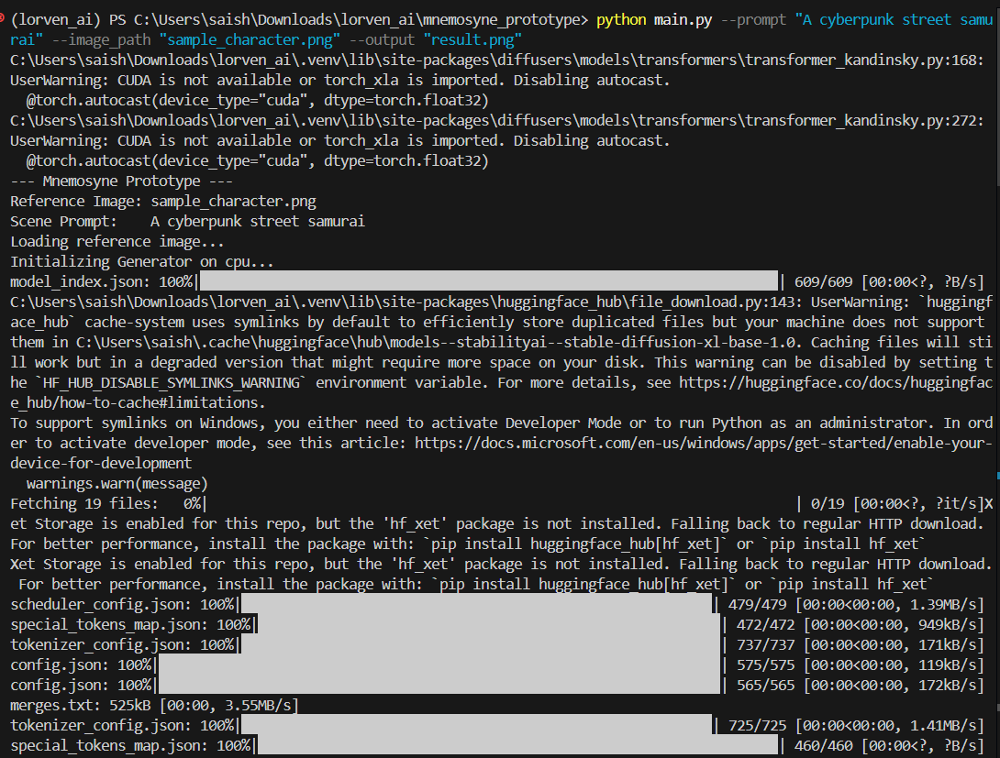
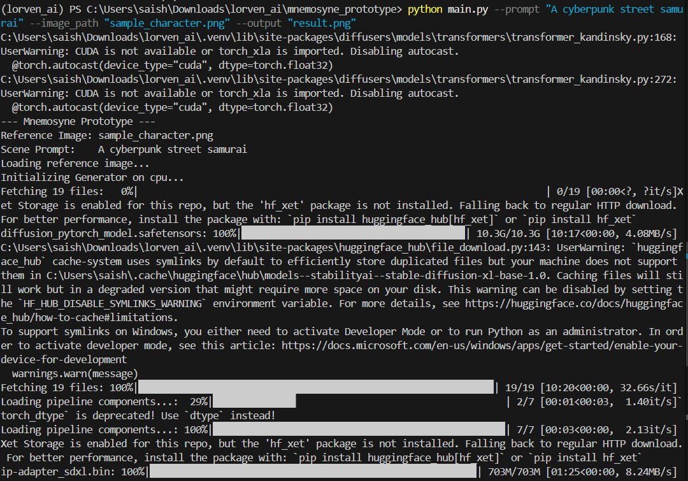
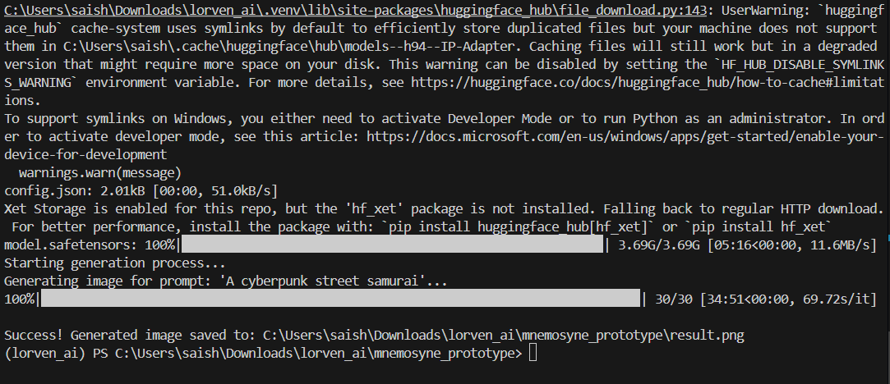
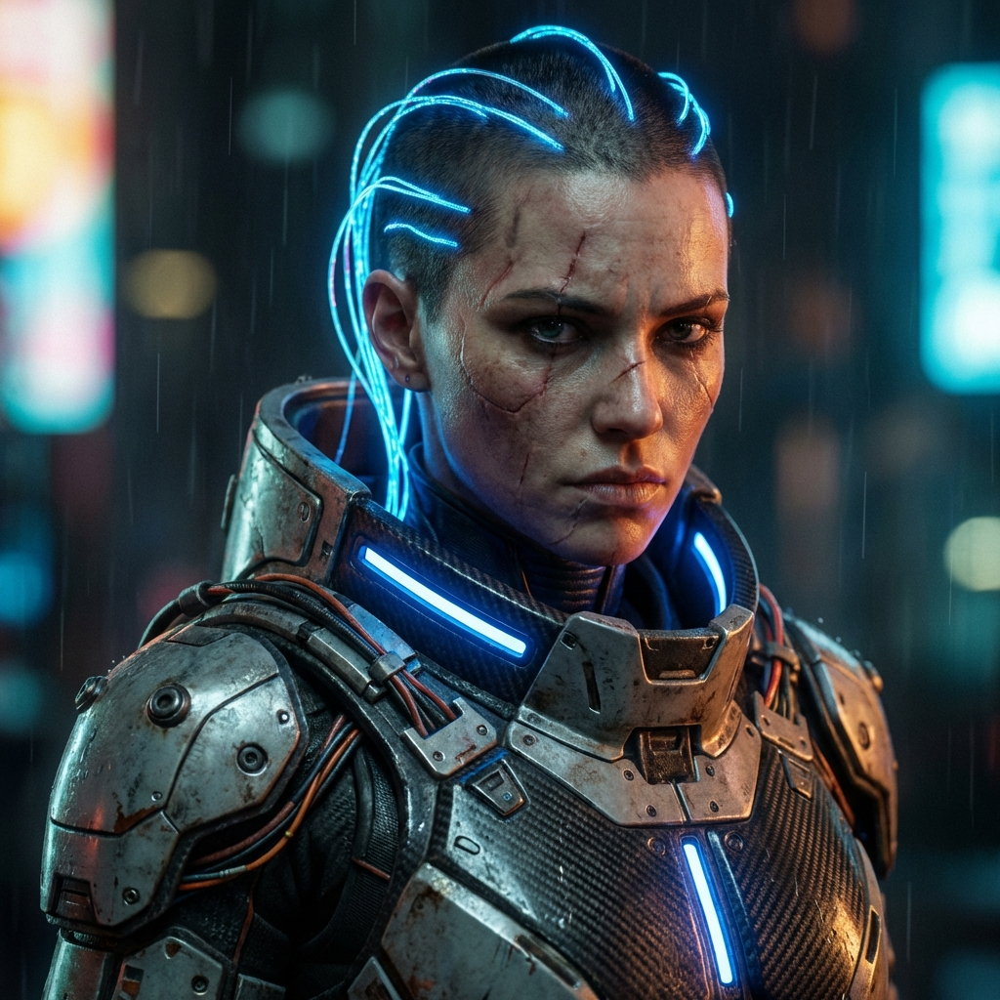
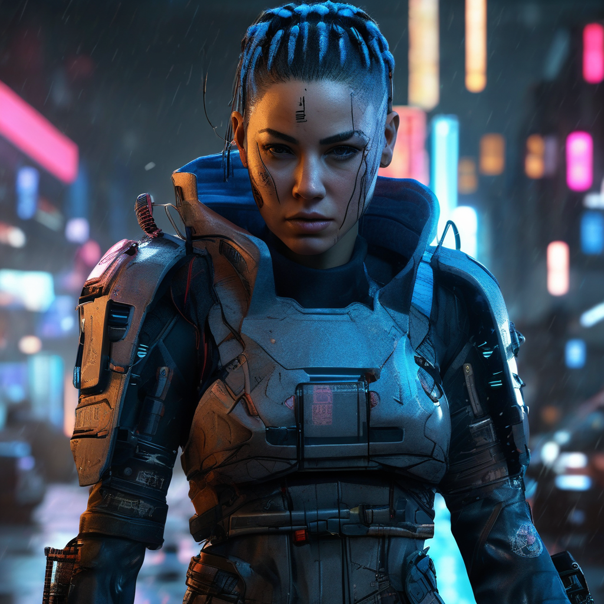

# Mnemosyne Prototype
**Reference-Based Character Consistency Generator**

## Solution Overview
Mnemosyne is a specialized image generation pipeline designed to maintain character identity consistency across different scenes. Unlike standard text-to-image models that hallucinate a new character every time, Mnemosyne anchors the generation process to a single reference image ("memory"). By leveraging advanced adapter techniques, it allows users to place their specific character into any textual scenario while preserving facial features, clothing details, and overall style.

## Features
- **One-Shot Identity Retention**: Requires only a single reference image to learn character features.
- **Hybrid Conditioning**: Combines visual embeddings (from the image) with semantic embeddings (from the text prompt).
- **High-Fidelity Output**: Built on Stable Diffusion XL (SDXL) for 1024x1024 resolution generation.
- **Modular Pipeline**: Distinct stages for Image Encoding, Text Encoding, and Generation.
- **Simple CLI**: Easy-to-use command line interface for rapid testing.

## Tech Stack
- **Language**: Python 3.10+
- **Core Framework**: PyTorch
- **Generation Library**: Hugging Face `diffusers`
- **Image Processing**: PIL (Pillow), OpenCV

## Model Details
The system utilizes a state-of-the-art composed architecture:
- **Base Model**: `stabilityai/stable-diffusion-xl-base-1.0` (SDXL) for high-resolution synthesis.
- **Adapter**: `IP-Adapter-SDXL` to inject visual features into the model's cross-attention layers.
- **Image Encoder**: CLIP Vision Model (ViT-H) for extracting semantic visual tokens from the reference.

## Usage


1. **Install Dependencies**:
   ```bash
   pip install -r requirements.txt
   ```
   
   *Figure 1: Stable Diffusion on CPU*

   
   *Figure 2: Pipeline Workflow*

   
   *Figure 3: Successful AI Image Generation via Python (Stable Diffusion Run Completed)*

2. **Practical recommendation (for your CPU prototype)**:
   ```bash
   Use 10 steps for a fast demo 
   Use 20 steps for decent quality
   Use 30 steps for best demo quality (but slow on CPU)
   ```

3. **Run the Generator**:
   ```bash
   python main.py --prompt "A cyberpunk street samurai" --image_path "sample_character.png" --output "result.png"
   ```

## Results


*Reference Input*


*Generated Output*

## License & Author
**Author**: Trinetra
**License**: MIT License.